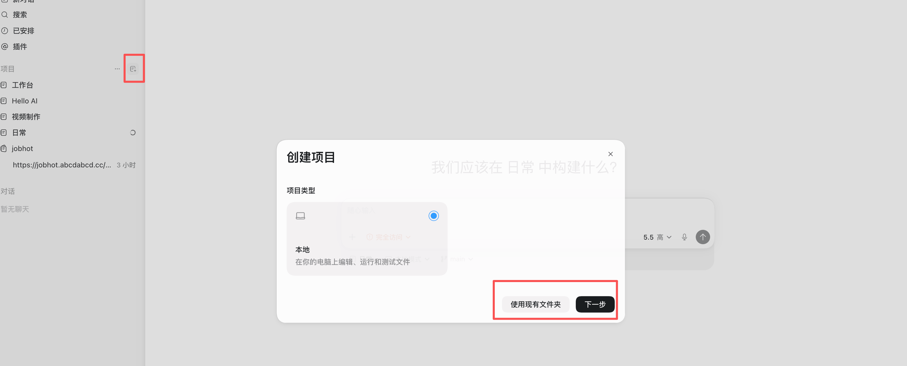
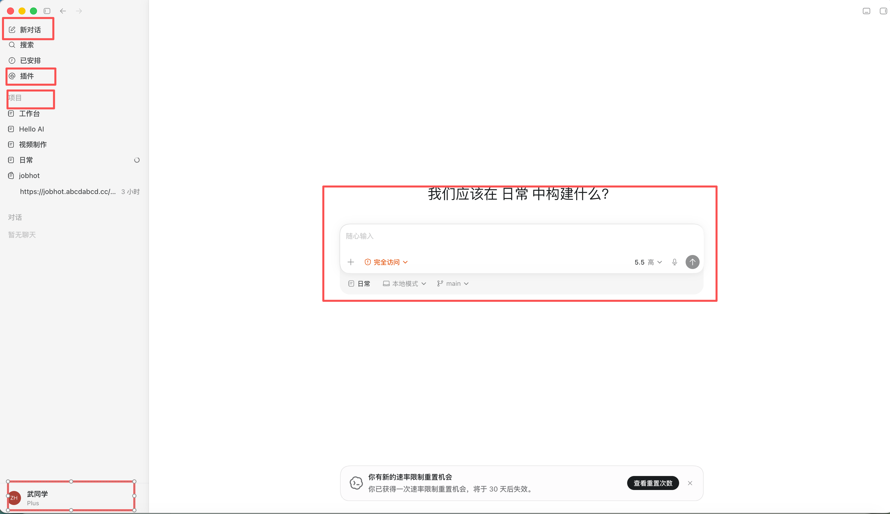
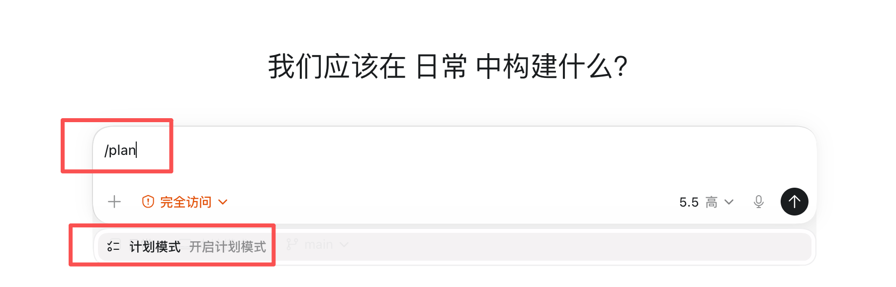
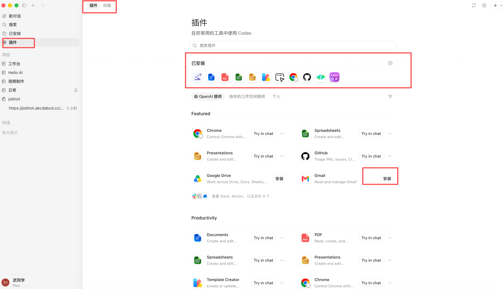
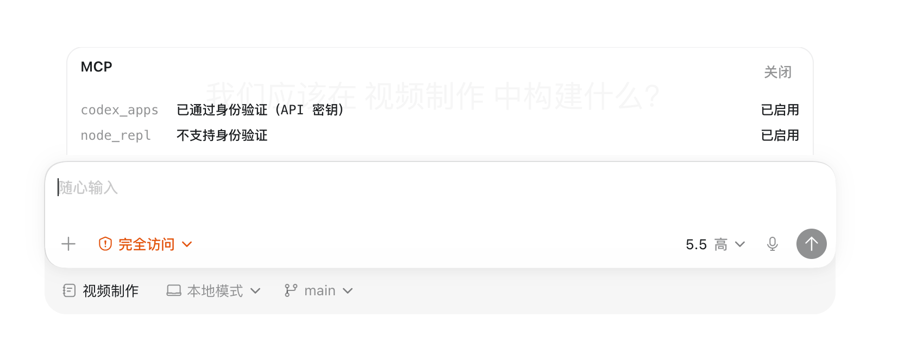
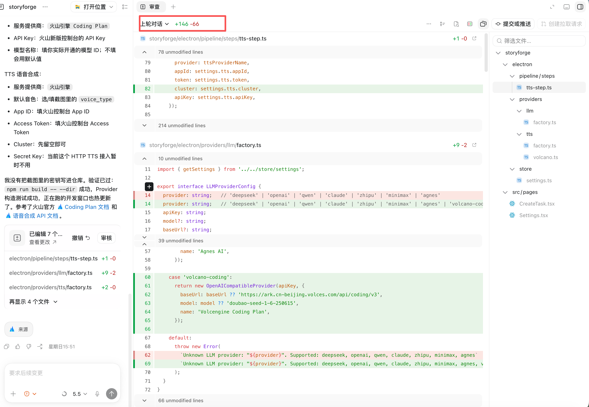

# CODEX · ORANGE BOOK
## NON-OFFICIAL GUIDE / 非官方指南

---

## 橙皮书
### 从安装到实战案例的全链路使用指南
**非官方开源指南 · 持续更新版**

**编 著 / BY 武小森**

---

| 01 | 02 | 03 | 04 | 05 |
|---|---|---|---|---|
| 认识 Codex | 安装与配置 | 核心功能 | 标准工作流 | 实战案例库 |

适合零基础上手、想把 Codex 接入真实工作流，以及希望系统化掌握 AI 编程智能体的开发者和内容创作者。

**v2.0 · 2026 · 07**

---

# Codex 橙皮书：从安装到实战案例的全链路使用指南
## 非官方开源指南 · 持续更新版
### 写给开发者、创作者和 AI 工具重度用户的全功能使用手册

| 版本 | 最后校验 | 资料性质 |
|---|---|---|
| v2.0 | 2026-07-06 | 非官方指南，不代表 OpenAI 官方文档或产品承诺 |

> 本文以 2026 年 7 月可访问的 Codex App、Codex CLI、Codex IDE Extension、Codex Web/Cloud 公开能力和实测界面为参考。Codex 更新很快，安装方式、模型名称、额度、入口位置和命令参数都可能变化；涉及具体功能和价格时，请以 OpenAI 官方文档、Codex 当前版本和你账号实际显示为准。

---

# 0. 使用说明

## 0.1 重要声明

- 本资料为**非官方指南**，不代表 OpenAI 官方文档。
- 所有功能以 OpenAI 官方文档和 Codex 实际版本为准。
- 本橙皮书会随着 Codex 更新持续维护。

## 0.2 这份橙皮书适合谁

| 人群 | 适合原因 |
|---|---|
| 完全没用过 Codex，想系统上手的人 | 第一篇到第三篇覆盖完整入门路径 |
| 会用 AI 工具，想把 Codex 接入真实工作流的人 | 第三篇核心功能 + 第四篇标准工作流 |
| 内容创作者 | 第五篇场景化指南 + 第六篇案例（PPT / 视频 / 网站） |
| 开发者 / 技术负责人 | 第三篇代码管理 + 案例四代码审查 |
| 数据分析或办公人群 | 第六篇案例五（数据分析） |

## 0.3 阅读路线

| 路线 | 适合人群 | 阅读顺序 |
|---|---|---|
| **快速上手路线** | 第一次用 Codex | 0 → 第一篇 → 第二篇 → 第四篇 → 选读案例 |
| **开发者路线** | 程序员 / 技术负责人 | 第一篇 → 第二篇 → 第三篇（代码管理）→ 案例四 |
| **内容创作路线** | 做 PPT/视频/网站的人 | 第一篇 → 第二篇 → 第三篇（插件）→ 案例一/二/三 |
| **进阶扩展路线** | 想深度定制 Codex 的人 | 第三篇（Skill/MCP）→ 第四篇 → 附录 |

## 0.4 已知限制与诚实建议

这本书不修饰 Codex 的问题。以下是你上手前应该知道的"坑"：

**上下文窗口：标称 1M，实际可用约 258K**

Codex 官方宣称支持 1M token 上下文，但在实际使用中，由于系统提示词、工具定义和上下文管理机制占用，真正可用于你的代码和对话的部分大约在 250K–260K token 左右。大型项目不要指望一次性把整个仓库塞进去，合理使用 `.codexignore` 排除无关文件。

**Windows Full Access 模式有真实风险**

社区已有多起 Windows 用户开启 Full Access（全自动）模式后，Codex 误删用户文件的报告，最严重的情况是全盘数据被清空（370GB / 700GB / 240GB 多人证实）。**绝对不要在 Windows 上对系统目录或重要数据目录使用 Full Access 模式**。macOS 和 Linux 由于沙盒机制更完善，风险相对较低，但仍建议先 `git commit` 再跑。

**Codex 不是万能的：和 Claude Code 各有长短**

Codex（GPT-5.5）在 SWE-bench Verified 上达到 82.6%，但 Claude Opus 4.7 在 SWE-Bench Pro 上仍领先（64.3% vs 58.6%）。实际体验：
- Codex 的沙盒隔离做得更好，安全敏感场景首选
- Claude Code 对大型项目的长文理解更强，复杂重构更靠谱
- 两个都装，按任务选择，是 2026 年开发者的理性做法

**额度消耗比你想的快**

复杂任务（尤其涉及大量文件读写和多轮对话）的 token 消耗很高。ChatGPT Plus（$20/月）的额度在密集使用时可能半天就耗尽。如果你是重度用户，Pro $100 档位是更现实的选择。省额度技巧：简单任务不要多轮对话，一次说清楚；复杂任务先出计划再执行，减少返工。

**Skill 和 MCP 生态仍在早期**

目前 Skill 和 MCP 连接器的数量在快速增长，但质量参差不齐。部分第三方 Skill 存在文档过期、命令不对、功能不稳定的问题。安装前建议先看 GitHub 最近的 commit 时间和 issue 列表，判断维护状态。

**模型更新可能改变行为**

OpenAI 更新模型（如从 GPT-5.4 到 GPT-5.5）后，Codex 的行为模式可能发生变化：之前能用的 prompt 技巧可能失效，代码风格可能改变，甚至某些功能入口会调整。建议关注 OpenAI 官方 changelog，遇到"突然不好用了"先排查是不是模型更新导致的。

**复杂任务需要多轮迭代**

不要指望一次对话就完美完成复杂任务。Codex 的正确用法是：先出计划 → 确认方向 → 分步执行 → 每步检查 → 逐步迭代。急于求成往往导致返工更多。

**Cloud 任务有时间限制**

Codex Cloud 单个任务有执行时间上限（通常 10–30 分钟，视订阅级别而定）。如果你的任务涉及大量文件生成或复杂构建，可能需要拆分为多个子任务分别提交。

<div class="contact-page">

<h2>联系方式</h2>

<p>本橙皮书由 <strong>武小森</strong> 编写。如需交流 AI 使用心得、获取更新或加入读者社群，欢迎扫码联系：</p>

<h3>知识星球</h3>

<p>陆续更新 AI 使用图文/视频教程、动向和技巧，并答疑解惑。</p>


<blockquote>知识星球限 100 人，满员后不再接受新成员。</blockquote>

<h3>其他联系方式</h3>

<table>
  <tr><th>公众号</th><th>视频号</th><th>个人微信</th></tr>
  <tr>
    <td></td>
    <td></td>
    <td></td>
  </tr>
  <tr>
    <td>获取最新 AI 工具指南和实战案例</td>
    <td>观看 AI 工具视频教程</td>
    <td>直接添加作者微信（备注：橙皮书读者）</td>
  </tr>
</table>

<h3>GitHub 仓库</h3>

<p style="text-align:center; margin: 12px 0;">
  <a href="https://github.com/diyiwuyan/codex-orange-book" style="display:inline-block; padding: 10px 28px; background: #e65100; color: #fff; text-decoration: none; border-radius: 24px; font-weight: 700; font-size: 16px;">github.com/diyiwuyan/codex-orange-book</a>
</p>

<h3>推荐阅读：WorkBuddy 橙皮书</h3>

<p style="text-align:center; margin: 12px 0; padding: 12px 18px; background: #fff3e0; border-radius: 12px; border: 2px dashed #e65100; display: inline-block;">
  <strong style="font-size: 16px; color: #e65100;">📕 获取方式</strong><br/>
  扫码添加上方个人微信，回复「<strong style="color:#bf360c;">workbuddy</strong>」获取《WorkBuddy 橙皮书》
</p>

</div>

---

# 第一篇：先搞懂 Codex 是什么

## Codex 基础认知

### Codex 到底是什么

Codex 是 OpenAI 推出的 **AI 编程智能体（Coding Agent）**。

很多人第一次听到 Codex，会下意识把它理解成"又一个 AI 写代码工具"。

但如果只把 Codex 当成"帮我写代码的 ChatGPT"，你很容易低估它。

Codex 真正重要的地方，不是它能不能写一个函数、补一段代码、解释一个报错，而是它代表了 AI 编程工具的一次角色变化：

> 以前，AI 是坐在你旁边帮你补代码的人。
> 后来，AI 是在编辑器里和你一起改代码的人。
> 现在，Codex 更像是一个可以被交代任务的工程执行者。

它不只是回答你"这段代码怎么写"，而是可以进入一个项目，读取文件，理解上下文，制定计划，修改代码，运行命令，检查结果，最后把改动整理成可以 review 的结果。

这就是 Codex 和普通 AI 聊天工具最大的区别。

---

### AI 编程工具的四次进化

过去几年，AI 编程工具大致经历了四个阶段：

**2021 年：Copilot 补全时代。** Codex 这个名字第一次被大量开发者听到，是因为 GitHub Copilot。那时 AI 主要负责代码补全：你写开头，它补后面；你写函数名，它补函数体。它像一个更聪明的输入法，能让你写得更快，但项目怎么拆、文件怎么找、测试怎么跑，仍然主要靠人完成。

**2022 年：ChatGPT 对话时代。** ChatGPT 出现后，AI 编程从"补全"进入"对话"。你可以直接问它报错原因、代码优化、接口写法、项目结构解释。AI 从输入法变成了问答伙伴。但它通常不在真实项目里，你需要复制代码、粘贴报错、手动补上下文，再把答案搬回项目。

**2023—2024 年：Cursor 项目协作时代。** Cursor 这类 AI 编辑器让 AI 真正进入编辑器，能看到文件、修改函数、跨文件重构、根据项目上下文完成一部分开发任务。AI 开始从"回答问题"变成"协助修改项目"。但它大多数时候仍依附在 IDE 里，你还需要盯着它改、判断下一步、跑测试、整理提交。

**2025 年：Codex 工程 Agent 时代。** Codex 重新出现后，已经不只是当年负责代码补全的模型，而是面向真实软件工程任务的 coding agent。它能读项目、解释代码、修 bug、加功能、补测试、重构模块、运行命令、检查 diff、整理 PR 说明，甚至并行处理多个工程任务。

这意味着，AI 编程工具的重点正在从"帮你写代码"转向"帮你交付任务"。

一句话总结：
> Copilot 帮你补代码，ChatGPT 帮你想代码，Cursor 陪你改项目，而 Codex 开始帮你执行工程任务。

---

### Codex 能做什么

很多人第一次用 Codex，会直接问：

> "帮我写一个登录页面。"
> "帮我修一下这个 bug。"
> "帮我做一个项目。"

这些当然可以，但还不够准确。

Codex 真正擅长的，不是凭空生成一段代码，而是在真实项目里完成一组工程任务。它可以读项目、找文件、理解上下文、制定计划、修改代码、运行命令、检查结果、整理 diff，最后把任务推进到可以 review 的状态。

所以，不要把 Codex 当成一个"代码生成按钮"。更准确地说：

> Codex 是一个可以进入项目现场的 AI 工程助手。

它能做的事，大致可以分成以下几类：

#### 1. 读懂一个陌生项目

使用 Codex 的第一步，不应该是让它直接写代码，而是让它先读项目。

它可以帮你快速搞清楚：
- 项目用什么技术栈
- 入口文件在哪里
- 核心模块在哪里
- 测试和构建命令是什么
- 哪些文件不能随便动

> 💡 很多 Codex 任务失败，不是因为它不会写代码，而是因为它还没理解项目，就被要求直接动手。

#### 2. 解释代码和梳理逻辑

Codex 可以帮你解释看不懂的代码。比如：
- 这个函数是做什么的
- 这个组件为什么这样写
- 接口调用链路是什么
- 状态从哪里来
- 这个 bug 可能和哪些文件有关

它不只是解释单个函数，还可以结合上下文，梳理模块关系、数据流和潜在风险。这对接手旧项目尤其有用。

#### 3. 修 bug 和加功能

Codex 很适合处理边界清楚的开发任务。比如：
- 修复一个可复现 bug
- 新增一个设置页
- 新增一个表单校验
- 新增一个接口
- 优化一个前端页面

> ⚠️ 但不要直接把一个大项目丢给它。更好的方式是把任务拆小：先读项目 → 再出方案 → 只改一个模块 → 跑测试 → 看 diff → 确认没问题后再继续。

#### 4. 写测试、做重构

Codex 可以帮你补测试，也可以帮你重构代码：
- 补单元测试、边界条件、异常场景
- 提取重复逻辑、拆分过长函数、整理组件结构

> ⚠️ 这类任务必须加边界：不改业务逻辑、不改公共 API、不引入无关依赖、修改后必须跑测试。

#### 5. 写文档和整理 PR

Codex 很适合写工程文档：README、安装说明、启动说明、接口文档、PR 描述、commit message、更新日志。

> 💡 文档不是附属品。在 Codex 工作流里，文档本身就是上下文基础设施。文档越清楚，后续人和 AI 接手项目都会更轻松。

#### 6. 跑命令、看 diff、做 review

Codex 和普通聊天工具最大的区别之一，是它可以在项目环境里运行命令：运行测试、lint、typecheck、build、查看 git status、查看 git diff、搜索代码、检查修改结果。

这让 Codex 不只是"猜答案"，而是可以验证结果。但命令执行也有风险：能验证的可以让它验证；有风险的必须由你批准；涉及生产环境、数据库、真实用户数据的操作，不要交给它自动执行。

---

### 核心能力一览

| 能力 | 说明 |
|---|---|
| **对话式开发** | 用自然语言描述需求，Codex 理解并执行 |
| **项目级理解** | 读取整个项目目录，理解文件结构和依赖关系 |
| **自主规划与执行** | 自动拆解任务、规划步骤、多步交付 |
| **本地文件操作** | 读取、修改项目目录里的代码和文件 |
| **代码运行与测试** | 在项目目录里运行命令、执行测试 |
| **插件系统** | 安装插件，连接外部工具（浏览器、邮件、云盘等） |
| **Skill 系统** | 安装专项技能，按固定流程执行 |
| **MCP 连接器** | 连接数据库、文档、API 等外部服务 |
| **Git 工作流** | 代码管理、diff 查看、提交、推送 |
| **云端运行** | 远程处理 GitHub 项目，适合长时间任务 |
| **自动化** | 定期复盘、检查、处理问题 |
| **记忆系统** | 从会话中沉淀偏好和规则 |

---

### Codex 四大形态

| 形态 | 适合谁 | 平台 | 功能完整度 |
|---|---|---|---|
| **Codex App** | 新手（最推荐） | macOS / Windows | ★★★★★（功能最强） |
| **Codex CLI** | 稍懂终端的人 | macOS / Windows / Linux | ★★★★☆ |
| **Codex IDE Extension** | 用 VS Code / Cursor 的人 | 编辑器插件 | ★★★☆☆ |
| **Codex Web / Cloud** | 想让 Codex 远程处理 GitHub 项目 | 网页 | ★★★☆☆ |

> 💡 **新手建议**：直接用 Codex App，图形界面、功能最全、上手最快。如果你主要做本地项目、网页练习和日常开发，优先从 Codex App 开始通常就够用；等你熟悉 Git、终端和团队协作后，再逐步补 CLI、IDE Extension 和 Web/Cloud。

---

## Codex 与同类工具的区别

### vs ChatGPT

很多人会问：既然 ChatGPT 也能写代码，为什么还要用 Codex？

核心区别在于：
> ChatGPT 更像一个顾问，有问题问 GPT，从它那里得到答案，然后自己去执行。现在 Codex 更像是一个实习生，我们能够真正地让它帮我们干活，交代任务能够完成这种。

ChatGPT 适合帮你想问题。Codex 适合帮你推进任务。

更合理的用法是：**先用 ChatGPT 想清楚，再用 Codex 进项目执行。**

### vs Cursor

很多人会把 Codex 和 Cursor 放在一起比较，因为它们都能帮你写代码、改代码、理解项目。但它们的定位并不一样。

> Cursor 更像一个 AI 编辑器，Codex 更像一个工程 Agent。

合理的用法是组合使用：用 Cursor 做日常编码和局部修改，用 Codex 做任务推进和工程交付。Cursor 负责陪你写，Codex 负责帮你跑完整任务。一个偏 IDE 协作，一个偏 Agent 执行。

### vs Claude Code

Codex 和 Claude Code 很像。都是 agentic coding 工具，但两者的侧重点不一样。

**Claude Code 更偏终端里的长期协作**：你打开终端，把它放进项目里，然后和它围绕一个开发任务持续协作。它适合长时间读项目、持续追踪一个复杂任务、在终端里边讨论边修改。

**Codex 更偏 OpenAI 生态里的多端任务执行**：优势不只在 CLI，而在 OpenAI 生态里的多端联动——App、CLI、IDE、Web 之间流转，让你用不同方式管理、执行和审查工程任务。

> 一句话总结：Claude Code 更像终端里的长期工程搭档，Codex 更像 OpenAI 生态里的多端工程 Agent。

---

## 什么时候适合用 Codex

适合 Codex 的任务，一般有几个特点：
- 目标明确
- 范围可控
- 上下文清楚
- 结果能验证
- 失败能回滚
- 风险可接受

**典型场景**：读项目、修 bug、加小功能、补测试、写文档、优化前端页面、整理 PR、审查 diff、处理重复任务。

---

## 什么时候不适合直接用 Codex

不建议直接让 Codex 处理：
- 生产数据库
- 真实用户数据
- 支付核心逻辑
- 权限和安全核心模块
- 大规模架构迁移
- 没有备份的重要项目
- 没有测试的核心业务
- 你自己也无法验收的任务

> **核心原则**：如果你判断不了结果对不对，就不要让 Codex 独立完成。Codex 可以提高效率，但不能替你做判断。

---

## 一句话总结 Codex

> - **初级用法**：让它帮你写代码。
> - **中级用法**：让它帮你读项目、改功能、跑测试。
> - **高级用法**：让它成为你的项目执行代理，配合规则、上下文、自动化和团队流程工作。

---

# 第二篇：安装、配置与界面认识

## 安装前准备

### 账号准备

| 项目 | 说明 |
|---|---|
| ChatGPT 账号 | 登录 Codex 用 |
| 网络 | 能正常访问 ChatGPT / OpenAI 服务 |
| 套餐 | 选择当前包含 Codex 的 ChatGPT 套餐（套餐名称、额度和功能范围会变化，请以官方页面为准） |
| GitHub 账号 | 如果要用 Codex Cloud 或推送代码，需要准备 |

### 系统准备

| 形态 | 支持平台 | 备注 |
|---|---|---|
| Codex App | macOS / Windows | 新手最推荐，功能最强 |
| Codex CLI | macOS / Windows / Linux | 适合稍懂终端的人 |
| Codex IDE Extension | VS Code / Cursor / Windsurf | 适合编辑器用户 |
| Codex Web / Cloud | 网页 | 适合远程处理 GitHub 项目 |

### 软件工具准备

| 工具 | 作用 | 下载 / 注册链接 |
|---|---|---|
| Git | 让 Codex 看代码变更、生成 diff、回滚修改 | Git 官方下载 |
| VS Code / Cursor | 方便查看和编辑代码 | VS Code 下载 / Cursor 下载 |
| 终端 | Windows 用 PowerShell；Mac 用 Terminal | 不用下载，系统自带 |
| 浏览器 | 登录 ChatGPT / OpenAI / GitHub | Chrome 下载 |
| Node.js | 做网页、前端、Next.js、Vite 项目常用 | Node.js 下载 |
| Python | 做脚本、自动化、数据处理常用 | Python 下载 |
| GitHub 账号 | 如果要用 Codex Cloud 或推送代码，需要准备 | GitHub 注册 |

---

## Codex App 安装与上手

> Codex App 是桌面版，图形界面，功能最全。**新手首选这一种。**

### 下载与安装

1. 访问 Codex App 官方页面下载安装包
2. macOS：将 Codex 拖入「应用程序」文件夹
3. Windows：运行安装程序，建议用默认路径，避免中文路径
4. 首次启动后，用 ChatGPT 账号登录

### 首次启动

1. 登录完成后，系统会让你选择一个**项目目录**
2. 项目目录 = Codex 的工作范围，它只能读写这个目录里的文件
3. **新手建议**：第一次选一个干净的练习目录，不要选系统盘，也不要一上来就选重要工作项目

推荐目录结构：

```
D:\AI-Codex-Projects\     ← Windows
~/AI-Codex-Projects/      ← macOS
```

> ⚠️ Windows 用户第一次使用时，建议不要在系统目录里运行 Codex。



### 界面布局

Codex App 的界面分为几个核心区域：

| 区域 | 功能 |
|---|---|
| **左侧栏** | 项目目录、会话列表、插件管理 |
| **主对话区** | 任务标题、消息列表、输入区 |
| **右侧面板** | 代码变更预览（diff）、文件列表 |



### 输入方式

Codex 的工作方式是对话 + 操作结合：

- 你在输入区用自然语言描述需求
- Codex 生成执行计划，你确认后它开始执行
- 执行过程中，Codex 会显示它在读什么文件、改了什么文件
- 你随时可以中断、提问、调整方向

> 💡 **关键理解**：Codex 不是聊天机器人，而是一个能对话的工程执行者。你和它的对话是任务推进过程，不是闲聊。

---

## Codex CLI 安装与上手

### 安装

```bash
npm i -g @openai/codex
```

### 使用

进入项目目录后启动：

```bash
cd 项目目录
codex
```

### 常用命令

| 命令 | 作用 |
|---|---|
| `codex` | 启动 Codex CLI |
| `/plugins` | 打开插件列表 |
| `/skills` | 打开 Skill 列表 |
| `/mcp` | 查看当前可用的 MCP 工具 |
| `/plan` | 先让 Codex 输出计划，再决定是否执行 |

---

## Codex IDE Extension / Web（简版）

| 方式 | 适合谁 | 官方文档 |
|---|---|---|
| **IDE Extension** | 用 VS Code / Cursor 的人 | 在 VS Code 插件市场搜索安装 |
| **Web / Cloud** | 想让 Codex 远程处理 GitHub 项目 | 连接 GitHub 仓库即可 |

> 这两种方式功能不如 App 完整，新手建议先用 App。

---

## 项目目录管理

### 项目目录 = Codex 的工作范围

Codex 不是单纯聊天工具，它需要进入一个具体项目目录工作。官方入门流程也是：登录 Codex 后，选择电脑上的文件夹或 Git 仓库，再开始第一个任务。

建议你提前建一个专门练习目录，比如：

```
D:\AI-Codex-Projects
```

### 访问项目外目录

Codex 可以读取、修改文件，还能在你的项目目录里运行命令。官方对 CLI 的描述就是：它可以在你选择的目录中读取、修改代码，并运行命令。

> ⚠️ 第一次打开 Codex App 后，登录完成，系统会让你选择一个项目目录。新手建议第一次选择一个干净的练习目录，不要直接 C 盘，也不要一上来就选择重要工作项目。

---

# 第三篇：核心功能详解

## 3.1 对话与任务执行

Codex 的基础交互方式是对话。你用自然语言描述需求，Codex 理解后执行。

### 好的需求描述四要素

1. **背景**：项目处于什么阶段、为什么要做
2. **目标**：要解决什么具体问题
3. **范围**：涉及哪些文件、改哪里
4. **验收标准**：怎样算完成

### 模糊 vs 具体

| 模糊说法 ❌ | 更清楚的说法 ✅ |
|---|---|
| 优化首页 | 优化首页首屏标题、副标题和 CTA 按钮 |
| 页面不好看 | 调整卡片间距、字体层级和按钮样式 |
| 登录有问题 | 修复点击登录按钮后没有跳转的问题 |
| 做一个后台 | 新增用户列表页，包含搜索、筛选和分页 |

---

## 3.2 计划模式

Codex 在动手前会先制定执行计划。这是它区别于普通 AI 聊天工具的关键。

### 典型流程

```
1. 你描述需求
2. Codex 列出执行计划（要改哪些文件、每步做什么）
3. 你确认计划
4. Codex 开始执行
5. 执行过程中展示进度和变更
6. 你审查结果
```

### 如何让 Codex 先出计划

```
先不要写代码，也不要修改任何文件。
请先根据当前需求和项目结构，制定一个修改计划。
等我确认后，再开始执行。
```

也可以直接输入 `/plan`，先让 Codex 输出计划，再决定是否执行。

> 💡 **使用建议**：任何复杂任务都先用计划模式。先确认方向正确，再让 Codex 动手，能避免大量返工。



---

## 3.3 插件系统

### 插件是什么

插件是给 Codex 额外安装的"能力包"，让它连接更多工具、使用固定流程、获得专项能力。



### 常见插件和能力方向

插件目录会随着 Codex 版本、工作区和账号权限变化。下面不是固定排名，而是常见能力方向，实际可安装内容以你当前 Codex 插件页显示为准。

| 类型 | 包含插件 | 适合做什么 |
|---|---|---|
| 浏览器与电脑操作 | Chrome、Computer Use | 网页测试、自动点击、软件操作 |
| 代码与项目协作 | GitHub | 管理仓库、修 bug、创建 PR |
| 前端与设计 | Build Web Apps、Figma | 生成网页、设计稿转代码 |
| 办公交付 | Documents、Presentations、Spreadsheets | 文档、PPT、表格分析 |
| 视频生成 | HyperFrames、Remotion | 用代码或 HTML 生成视频 |

### 10 个常见插件详解

| 序号 | 插件 | 主要作用 | 简单来说 |
|---|---|---|---|
| 1 | Chrome | 让 Codex 直接操作浏览器 | 可以打开网页、点击按钮、检查页面效果、测试网页功能 |
| 2 | GitHub | 代码仓库管理与协作 | 让 Codex 读取仓库、处理 issue、改代码、创建 PR |
| 3 | Computer Use | 让 Codex 操作电脑 | 像人一样看屏幕、点按钮、操作软件，权限比较高 |
| 4 | Build Web Apps | 一句话生成前端网页应用 | 输入需求，生成网页、小工具、落地页、Demo |
| 5 | Figma | 设计稿转代码与原型设计 | 把 Figma 设计稿变成前端页面，适合 UI 开发 |
| 6 | Documents | AI 帮你交付正式文档 | 生成 README、项目说明、教程文档、产品文档 |
| 7 | Presentations | AI 生成高质量 PPT | 根据内容生成汇报、课程、产品介绍、方案型 PPT |
| 8 | Spreadsheets | AI 数据分析与表格处理 | 帮你整理 Excel、分析数据、生成表格结论 |
| 9 | HyperFrames | HTML 直接生成视频 | 用网页/HTML 结构生成视频内容 |
| 10 | Remotion | 用代码生成高质量视频 | 用 React/代码方式生成更专业的视频 |

### 怎么安装插件

**在 Codex App 里**：
1. 打开 Codex App
2. 进入插件管理页面
3. 搜索或浏览插件
4. 点击「Add to Codex」或添加按钮
5. 安装完成后，新开一个对话使用

**在 Codex CLI 里**：
```bash
/plugins
```
打开插件列表后，可以搜索插件、查看详情、Install plugin、Uninstall plugin、Space 对已安装插件启用或停用。

---

## 3.4 Skill 系统

### Skill 是什么

Skill 是给 Codex 准备的一套「固定工作方法」。

Codex 本身会读代码、改代码、运行命令。但如果你经常让它做同一类任务，比如写 README、做代码 Review、生成网页、整理文档，就可以把这套流程做成 Skill。

### Skill 和普通提示词有什么区别

| 对比维度 | 普通提示词 | Skill |
|---|---|---|
| 使用方式 | 每次手动输入 | 保存成固定能力 |
| 稳定性 | 容易漏要求 | 更稳定 |
| 适合场景 | 临时任务 | 重复任务 |
| 复用性 | 低 | 高 |
| 内容结构 | 一段提示词 | 指令、模板、资料、脚本 |

> 一句话：只做一次的任务 = 直接写提示词；经常重复做的任务 = 适合做 Skill。

### Skill 还是 MCP？什么时候用哪个

记住一句话：「怎么做」的问题用 Skill，「连接什么工具」的问题用 MCP。

| 你的需求 | 用 Skill 还是 MCP |
|---|---|
| 写 README、固定文档输出格式 | Skill |
| 做代码 Review、UI Review | Skill |
| 生成落地页、把修 bug 流程标准化 | Skill |
| 查最新开发文档、新版本 API | MCP |
| 连接数据库 | MCP |
| 读取 Figma 设计稿 | MCP |
| 读取 GitHub issue / PR | MCP |
| 连接 Notion、内部知识库 | MCP |


### Skill 通常包含什么

| 内容 | 作用 |
|---|---|
| instructions | 告诉 Codex 怎么做 |
| resources | 放参考资料、模板、标准 |
| scripts | 可选脚本，用来自动处理任务 |
| examples | 示例输入和示例输出 |
| checklist | 检查清单，防止漏步骤 |

### 怎么添加 Skill

**方式一：使用已有 Skill**

在 Codex 对话中输入：
```
/skills
```
或直接输入 `$`，Codex 会显示当前可用的 Skill。

**方式二：用 $skill-creator 创建 Skill**

```
$skill-creator

请帮我创建一个 README Skill。

这个 Skill 的作用：
根据当前项目自动生成适合小白阅读的 README。

触发场景：
当我说"生成 README""写项目说明""整理项目文档"时使用。

工作流程：
1. 先阅读项目结构
2. 查看 package.json、README、入口文件
3. 判断项目类型
4. 生成项目简介
5. 写安装步骤
6. 写启动命令
7. 说明主要文件夹作用
8. 补充常见问题
9. 不确定的地方不要编造
```

**方式三：手动创建 SKILL.md 文件**

Skill 本质上是一个文件夹，里面必须有一个 `SKILL.md`：

```
.agents
└── skills
    └── readme-skill
        ├── SKILL.md
        ├── scripts/        (可选)
        ├── references/     (可选)
        └── assets/         (可选)
```

最简单的 SKILL.md 示例：

```markdown
---
name: readme-skill
description: 当用户需要生成 README、项目说明、安装教程、启动步骤时使用。
---

你是一个 README 文档生成助手。

任务：
根据当前项目生成一份适合新手阅读的 README。

工作流程：
1. 阅读项目结构
2. 查看 package.json、README、入口文件
3. 判断项目类型
4. 生成项目介绍
5. 写安装步骤
6. 写启动命令
7. 说明文件结构
8. 补充常见问题

输出格式：使用 Markdown。

注意事项：不要编造不存在的功能。
```

### Skill 放在哪里

| 放置位置 | 适合场景 | 简单来说 |
|---|---|---|
| 项目里的 `.agents/skills` | 只给当前项目用 | 项目专属 Skill |
| 用户级 Skill 目录 | 自己多个项目都想用 | 个人通用 Skill |
| 团队 / 管理员配置 | 团队成员统一使用 | 团队共享 Skill |
| 插件里 | 想打包分发给别人安装 | 正式能力包 |

---

## 3.5 MCP 连接器

> 只有进阶 AI 编程才需要了解，普通人可以直接跳过这一节。

### MCP 是什么

MCP（Model Context Protocol）是连接外部工具的接口，让 Codex 能操作数据库、文档、API 等外部服务。

**生活化理解**：
- Codex = 一个会干活的人
- MCP = 给他接上不同工具的插座
- MCP Server = 插在插座上的工具箱
- Tool = 工具箱里的具体工具



### MCP 适合做什么

| 场景 | MCP 可以怎么用 |
|---|---|
| 查开发文档 | 连接文档 MCP，让 Codex 查新版本 API |
| 连接数据库 | 让 Codex 查询数据库结构或测试数据 |
| 连接设计工具 | 让 Codex 读取设计稿、组件信息 |
| 连接项目管理工具 | 读取 issue、任务、需求说明 |
| 连接内部系统 | 调用公司内部工具或数据源 |
| 连接知识库 | 让 Codex 根据团队文档工作 |

> 小白可以这样判断：普通写代码，不一定需要 MCP；需要 Codex 访问外部工具或外部数据时，才考虑 MCP。

### 常见 MCP Server

| MCP Server 类型 | 能提供什么 |
|---|---|
| 文档 MCP | 查询开发文档、API 文档 |
| 数据库 MCP | 查询表结构、读取测试数据 |
| GitHub MCP | 读取 issue、PR、仓库信息 |
| Figma MCP | 读取设计稿信息 |
| Notion MCP | 读取知识库页面 |
| 浏览器 MCP | 访问网页、获取页面信息 |

### 在 Codex App 里怎么使用 MCP

| 步骤 | 操作 | 简单来说 |
|---|---|---|
| 1 | 打开 Codex App | 进入桌面版 Codex |
| 2 | 进入 Settings | 打开设置 |
| 3 | 找到 MCP servers | 进入 MCP 工具管理区 |
| 4 | 查看 recommended servers | 查看官方或系统推荐的 MCP |
| 5 | 添加 custom server | 添加自己的 MCP server |
| 6 | 按提示完成授权 | 有些 MCP 需要登录外部账号 |
| 7 | 回到项目 thread | 在任务里调用 MCP |
| 8 | 查看结果和权限请求 | 确认 Codex 调用了什么工具 |

### 在 Codex CLI 里怎么使用 MCP

常用 MCP 终端命令：

| 命令 | 作用 |
|---|---|
| `codex mcp --help` | 查看 MCP 命令帮助 |
| `codex mcp list` | 查看已配置 MCP server |
| `codex mcp add` | 添加 MCP server |
| `codex mcp remove` | 删除 MCP server |
| `codex mcp get` | 查看某个 MCP server 详情 |
| `codex mcp login` | 登录需要授权的 MCP |
| `/mcp` | 在 Codex 会话里查看 MCP |

**添加 MCP 的基本格式**：

```bash
codex mcp add 名称 -- 启动命令
```

**示例**：

```bash
codex mcp add context7 -- npx -y @upstash/context7-mcp
```

这条命令可以理解成：给 Codex 添加一个叫 context7 的 MCP，它通过 npx 启动 `@upstash/context7-mcp` 这个工具。

### MCP 配置文件在哪里

Codex 的 MCP 配置会写进配置文件里。常见位置是：

```
~/.codex/config.toml
```

里面可能会有类似这样的配置：

```toml
[mcp_servers.context7]
command = "npx"
args = ["-y", "@upstash/context7-mcp"]
```

> 💡 如果你不熟悉配置文件，前期不要手动乱改。优先使用 `codex mcp add`、`codex mcp list`、`codex mcp remove`。

---

## 3.6 代码管理（Git 与 GitHub 工作流）

用 Codex 做真实项目时，一定要懂一点 Git 和 GitHub。

小白可以先这样理解：
- **Git** = 本地代码版本管理工具
- **GitHub** = 把代码放到网上协作的平台
- **Codex** = 帮你读代码、改代码、跑命令的 AI 编程助手

一句话：Git 负责记录代码变化。GitHub 负责远程保存和协作。Codex 负责帮你完成具体编程任务。

### Git 和 GitHub 有什么区别

| 对比 | Git | GitHub |
|---|---|---|
| 简单来说 | 本地版本管理工具 | 代码云盘 + 协作平台 |
| 主要作用 | 记录代码每次改了什么 | 远程保存代码、团队协作 |
| 使用位置 | 你的电脑里 | 浏览器 / 云端 |
| 核心能力 | commit、branch、diff、merge | repository、issue、pull request |
| 是否必须联网 | 不需要 | 需要 |
| 和 Codex 的关系 | Codex 改完代码后，用 Git 检查和保存 | Codex Web / Cloud 常和 GitHub 配合 |

### 小白必须先懂的 Git 概念

| 概念 | 简单来说 | 作用 |
|---|---|---|
| Repository | 一个代码仓库 | 存放整个项目 |
| Commit | 一次代码存档 | 记录这次改了什么 |
| Branch | 分支 | 在不影响主线的情况下改代码 |
| Diff | 改动对比 | 看新增、删除、修改了什么 |
| Stage | 暂存区 | 准备把哪些改动保存进 commit |
| Merge | 合并 | 把一个分支的改动合到另一个分支 |
| Conflict | 冲突 | 两边改了同一处代码，需要手动选择 |
| Push | 推送 | 把本地代码上传到 GitHub |
| Pull | 拉取 | 把 GitHub 上的新代码同步到本地 |
| Clone | 克隆 | 从 GitHub 下载一个项目到本地 |

### 为什么用 Codex 更需要 Git

| 场景 | 为什么需要 Git |
|---|---|
| Codex 改了很多代码 | 可以查看具体改了哪里 |
| Codex 改错了 | 可以回退到之前版本 |
| Codex 删除了不该删的内容 | 可以用 Git 找回 |
| 多次让 Codex 修改 | 每次 commit 保存一个阶段 |
| 想让 Codex 大胆试方案 | 用 branch 或 worktree 隔离风险 |
| 要把项目放到 GitHub | 需要 push 到远程仓库 |
| 团队协作 | 需要 PR、review、merge |

> 一句话：没有 Git，Codex 改错了你很难回退。有了 Git，Codex 可以放心试，你可以随时检查和恢复。



### 如何在 Codex 中使用 Git

| 步骤 | 操作 | 目的 |
|---|---|---|
| 1 | 初始化 Git | 让项目开始被 Git 管理 |
| 2 | 写好 .gitignore | 防止上传垃圾文件和密钥 |
| 3 | 先 commit 一次 | 保存干净版本 |
| 4 | 新建分支 | 给 Codex 一个安全实验区 |
| 5 | 让 Codex 修改代码 | 完成具体任务 |
| 6 | 查看 diff | 检查 Codex 改了什么 |
| 7 | 运行项目 / 构建 | 确认没出错 |
| 8 | 满意后 commit | 保存这次修改 |
| 9 | push 到 GitHub | 上传远程仓库 |
| 10 | 创建 PR | 合并前再检查一次 |

在 Codex 对话框中输入：
```
把项目初始化成一个 Git 工程，并排除不需要的文件
```
Codex 会帮我们直接写好 .gitignore 文件。

### 标准上传流程

| 步骤 | 操作 | 目的 |
|---|---|---|
| 1 | 在 GitHub 新建仓库 | 创建一个远程项目空间 |
| 2 | 复制仓库地址 | 后面要连接本地项目 |
| 3 | 将地址复制给 Codex | 让 Codex 知道要上传到哪个仓库 |
| 4 | 推送到 GitHub | 正式上传代码 |

### 代码回滚

如果 Codex 改错了，可以回滚到之前的版本：

1. 先让 Codex 修改代码
2. 提交到 Git，保存好当前版本
3. 继续修改代码
4. 打开 IDE 查看代码并回退代码
5. 复制版本号给 Codex，让它回退代码到指定版本

### Git Worktree（进阶）

给同一个 Git 项目，额外开一个独立工作副本。相当于一个草稿本，效果满意后再合并回正式项目。

| 场景 | Worktree 的作用 |
|---|---|
| 想让 Codex 大胆改代码 | 给它单独开一个副本 |
| 不想影响当前项目 | 主项目保持不动 |
| 想同时做多个任务 | 每个任务一个 worktree |
| 想比较多个方案 | 方案 A / B / C 分开放 |
| 改坏了不想要 | 直接丢掉 worktree |
| 做大改动 / 重构 | 降低污染主项目的风险 |

---

## 3.7 记忆系统

让 Codex 记住一些长期有用的信息，方便以后继续工作。

### 项目级 AGENTS.md

AGENTS.md 是写给 Codex 看的项目规则说明书。

| 文件 | 主要读者 | 作用 |
|---|---|---|
| README.md | 人 | 告诉人这个项目是什么、怎么安装、怎么使用 |
| AGENTS.md | Codex / AI Agent | 告诉 AI 在这个项目里应该怎么工作 |
| .gitignore | Git | 告诉 Git 哪些文件不要上传 |

### AGENTS.md 放在哪里

| 放置位置 | 作用范围 | 简单来说 |
|---|---|---|
| 项目根目录 AGENTS.md | 整个项目 | 当前项目的总规则 |
| 子目录里的 AGENTS.md | 当前子目录及相关任务 | 某个模块的专属规则 |
| 用户级 ~/.codex/AGENTS.md | 你所有项目 | 个人通用规则 |
| 项目级 + 用户级 | 叠加生效 | 个人习惯 + 当前项目规则 |

### 如何写 AGENTS.md

可以直接交给 AI 来写，让 AI 总结这个项目的核心内容制作成 AGENTS.md。

**前端项目 AGENTS.md 模板**：

```markdown
# AGENTS.md

## 项目说明
这是一个前端网页项目，用于构建产品页面、工具页面或个人作品展示页面。

## 技术栈
- React
- Vite
- Tailwind CSS
- JavaScript / TypeScript

## 常用命令
- 安装依赖：`npm install`
- 启动项目：`npm run dev`
- 构建项目：`npm run build`

## 项目结构
- `src/`：主要源代码
- `src/components/`：通用组件
- `src/pages/`：页面文件
- `src/assets/`：图片、图标等静态资源
- `public/`：公开静态文件

## 代码规范
- 优先使用 React 函数组件
- 优先使用 Tailwind CSS 写样式
- 不要引入 Bootstrap
- 不要大范围重构无关代码
- 修改时保持文件结构清晰
- 中文文案要自然、简洁、适合普通用户阅读

## UI 规则
- 页面要有清晰的信息层级
- 按钮、卡片、标题、留白要统一
- 移动端要基本可用
- 不要过度渐变、阴影和 AI 模板感
- 优先做真实产品感，而不是 Demo 感

## 禁止事项
- 不要修改 `.env`、`.env.local`
- 不要输出 API Key、token、密码
- 不要删除已有核心功能
- 不要随意新增大型依赖
- 不要直接改动和当前任务无关的文件

## 完成任务后
每次修改完成后，请输出：
1. 修改了哪些文件
2. 每个文件改了什么
3. 为什么这样改
4. 是否需要运行 `npm run build`
5. 提醒我检查 diff
```

### 好的 AGENTS.md 有什么特点

| 特点 | 说明 |
|---|---|
| 具体 | 写清楚技术栈、命令、目录 |
| 简洁 | 不要写成长篇废话 |
| 可执行 | Codex 看了知道怎么做 |
| 有限制 | 明确哪些文件不能碰 |
| 有验证 | 写清楚运行什么命令检查 |
| 有完成标准 | 让 Codex 知道交付什么 |
| 可维护 | 项目变化后及时更新 |

### 全局级 AGENTS.md

打开 Codex 的设置，找到个性化，输入指令。这里的指令会作为你的个人通用偏好影响后续 Codex 会话。

**示例：防止 AI 乱删文件**

```
禁止批量删除文件或目录。
不要使用：
  del /s
  rd /s
  rmdir /s
  Remove-Item -Recurse
  rm -rf

需要删除文件时，只能一次删除一个明确路径的文件。
正确示例：
  Remove-Item "C:\path\to\file.txt"

如果需要批量删除文件，应停止操作，并向用户请求，让用户手动删除。
```

---

## 3.8 自动化（进阶）

### 什么是自动化

让 Codex 按规则定期帮你巡查项目、发现问题、处理问题。就像给项目请了一个"AI 值班工程师"：平时它不打扰你，有问题它来提醒你，简单问题它先尝试修，最后让你审核决定。

### 示例

```
请检索并复盘最近一周的 Codex 会话记录与执行日志，维护一份"Codex 会话复盘与个人风格档案"。

要求：
1. 优先使用可用的会话历史检索能力
2. 不要复现原始日志、隐私内容、密钥
3. 总结执行经验：哪些做法导致了问题，最终正确做法是什么
4. 总结我的偏好：UI 设计偏好、产品理念、交互原则
5. 整理可复用规则清单
6. 如有适合长期复用的规则，请建议是否加入 AGENTS.md
```

> 自动化属于进阶功能，普通用户可以先不用管。

---

## 3.9 云端运行

Codex 的云端任务适合在你不方便一直开着本地电脑时继续处理工作；如果你的账号和客户端支持移动端入口，也可以在外出时查看或推进部分任务。

### 小白可以这样理解

| 模式 | 运行位置 | 简单来说 |
|---|---|---|
| Local | 你的电脑本地项目 | Codex 直接改你电脑里的代码 |
| Worktree | 你的电脑本地副本 | Codex 在安全副本里改代码 |
| Cloud | OpenAI 云端环境 | Codex 在云端拉取 GitHub 仓库并处理任务 |

### 云端运行是什么

| 内容 | 说明 |
|---|---|
| 运行环境 | 云端容器 |
| 代码来源 | GitHub 仓库 |
| 工作方式 | Codex 在云端读取、修改、运行、验证代码 |
| 最终结果 | 生成修改结果、diff，必要时创建 PR |
| 适合任务 | 修 bug、改功能、写文档、代码 review、处理 issue |
| 不适合任务 | 本地私密文件、没有上传 GitHub 的项目、高风险生产操作 |

### 云端运行和本地运行的区别

| 对比 | 本地运行 | 云端运行 |
|---|---|---|
| 代码位置 | 你电脑里 | GitHub 仓库 |
| 运行位置 | 你的电脑 | 云端容器 |
| 是否占用电脑 | 会占用 | 基本不占用 |
| 是否需要 GitHub | 不一定 | 通常需要 |
| 是否适合后台任务 | 一般 | 很适合 |
| 是否适合并行任务 | 一般 | 很适合 |
| 权限风险 | 主要是本机文件权限 | 主要是仓库、环境变量、网络权限 |
| 适合新手吗 | 更适合先学 | 学会 GitHub 后再用 |

### 云端运行操作步骤

1. 推送代码到 GitHub
2. 打开 Codex Web
3. 选择要修改的仓库
4. 让 Codex 工作
5. 修改完成后上传到 GitHub 仓库
6. 本地修改前先同步 GitHub 仓库里的最新代码

> 💡 如果云端任务已经把修改推回 GitHub，本地继续开发前要先同步最新代码，避免在旧版本上继续修改导致冲突。

---

# 第四篇：标准工作流

## 从需求到交付的完整链路

很多人刚开始用 Codex，会直接一句话丢给它：

> "帮我做一个网站。"
> "帮我改这个功能。"
> "帮我优化这个项目。"

这样不是不行，但很容易出现一个问题：AI 改得很快，但你不知道它到底改了什么，也不知道能不能放心交付。

所以真正稳定的方式，不是让 Codex 一口气乱改，而是按照一套固定工作流来推进。你可以把它理解成：需求不是直接变成交付物，中间必须经过"理解、计划、修改、验证、检查、验收"这几步。

### 标准六步法

| 步骤 | 名称 | 简单来说 | 目的 |
|---|---|---|---|
| 1 | 需求拆解 | 先让 Codex 知道要做的项目是什么 | 避免不了解结构就乱改 |
| 2 | 制定计划 | 先列出要做什么，确认后再动手 | 避免一步改太多、方向跑偏 |
| 3 | 小步实现 | 一次只改一小块 | 降低出错概率，方便回滚 |
| 4 | 测试 | 改完后运行检查并手动验证 | 确认代码没有明显报错 |
| 5 | 代码审查 | 看 diff，检查改得对不对、有没有风险 | 防止 AI 改到不该改的地方 |
| 6 | 提交与复盘 | 提交代码并沉淀经验 | AI 负责执行，人负责拍板 |

### 第一步：需求拆解

在让 Codex 修改项目之前，第一件事不是写代码，而是先拆需求。很多人用 Codex 容易翻车，不是因为 Codex 不会写代码，而是因为一开始需求没说清楚。

比如你只说"帮我优化首页"，Codex 可能会理解成：改 UI、改文案、改布局、改组件结构、改路由，甚至顺手删掉一些它觉得"没用"的代码。

**好的需求应该能回答**：

| 问题 | 示例 |
|---|---|
| 背景是什么 | 这是一个已经上线的官网页面 |
| 要解决什么问题 | 首屏转化率低，用户不知道产品卖点 |
| 哪些文件可能相关 | `app/page.tsx`、`components/Hero.tsx` |
| 哪些功能不能动 | 不要改登录逻辑、接口地址、数据结构 |
| 什么结果算完成 | 首屏标题清晰、CTA 按钮明显、移动端适配 |
| 需要哪些测试 | 页面预览、构建测试、移动端测试 |

**需求拆解提示词模板**（可直接复制）：

```
请先帮我做需求拆解，不要立刻修改代码。

需求：【这里写你的需求】

请按下面结构分析：

1. 背景是什么
- 当前项目大概是什么
- 为什么要做这个需求
- 这个需求属于新功能、Bug 修复、UI 优化，还是重构

2. 要解决什么问题
- 当前具体问题是什么
- 本次要解决到什么程度
- 哪些内容不是本次范围

3. 哪些文件可能相关
- 请根据项目结构判断可能涉及哪些文件
- 先列出来，不要直接修改

4. 哪些功能不能动
- 不要改哪些逻辑
- 不要动哪些接口
- 不要影响哪些页面或组件

5. 什么结果算完成
- 功能完成标准
- 页面完成标准
- 代码完成标准

6. 需要哪些测试
- 需要运行什么命令
- 需要手动检查哪些页面

7. 有哪些风险
- 可能影响哪些功能
- 是否有样式污染风险

最后，请给我一个简短的执行建议：
- 建议先做哪一步
- 是否需要我确认后再修改
```

### 第二步：制定计划

需求拆解完成后，不要马上让 Codex 写代码。这一步要让 Codex 先制定计划。很多项目翻车，不是因为 Codex 不会改，而是因为它一上来就开始改。等你发现方向不对时，它可能已经改了很多文件，回头检查和回滚都很麻烦。

所以第二步的核心是：**先计划，后执行。先确认，后修改。**

```
先不要写代码，也不要修改任何文件。
请先根据当前需求和项目结构，制定一个修改计划。
等我确认后，再开始执行。
```

### 第三步：小步实现

计划确认后，才进入真正的代码修改阶段。但这里有一个非常重要的原则：**不要让 Codex 一次性把所有东西都改完。**

比如你要优化首页，不要一次性说"请帮我优化整个首页"。更推荐拆成这样：

| 步骤 | 修改内容 |
|---|---|
| 第一步 | 只优化首屏标题和副标题 |
| 第二步 | 只调整 CTA 按钮 |
| 第三步 | 只优化移动端布局 |
| 第四步 | 只补充产品卖点卡片 |
| 第五步 | 只处理最终样式细节 |

> ⚠️ 不要让 Codex 顺手重构无关代码。Codex 有时候会觉得某些代码"不够优雅"，然后顺手帮你重构。但真实项目里，顺手重构是很危险的。

**小步实现提示词模板**：

```
请开始小步实现。

当前只执行第【1】步：
【这里写本次只做的一个功能点】

要求：
1. 一次只改这个功能点
2. 只修改和当前功能直接相关的文件
3. 不要顺手重构无关代码
4. 不要修改目录结构
5. 不要新增不必要依赖
6. 不要删除已有功能
7. 不要改计划外的文件

修改完成后请停止，并输出：
1. 本次修改了哪些文件
2. 每个文件改了什么
3. 为什么这些修改是必要的
4. 有没有改到计划外内容
5. 有没有潜在风险
6. 下一步建议做什么

注意：
如果遇到不确定的地方，请先停下来问我，不要自行决定。
```

### 第四步：测试

Codex 完成小步修改后，不能马上进入下一步，必须先测试。

**测试清单**（按从快到慢的顺序执行）：

| 测试类型 | 作用 | 常见命令 |
|---|---|---|
| 单元测试 | 检查函数、组件、模块是否正常 | `npm test` |
| 类型检查 | TypeScript 项目提前发现类型错误 | `npm run typecheck` |
| lint | 检查代码规范问题 | `npm run lint` |
| 构建 | 本地能打开不代表能上线，构建才说明能打包 | `npm run build` |
| 手动测试 | UI、表单、登录、支付、上传必须手动点一遍 | —— |
| 浏览器测试 | 终端看不出来的页面/控制台/接口问题 | —— |
| 回归测试 | 不只测新功能，还要测旧功能有没有被改坏 | —— |

### 第五步：代码审查

测试通过后，不代表这次修改就可以直接交付。还需要做代码审查。

**两轮审查：Codex 自审 + 人工审查**

第一轮先让 Codex 自查刚才的修改，最好让它输出成表格：

| 检查项 | 结果 | 说明 |
|---|---|---|
| 是否改到计划外文件 | 否 | 只修改了首页相关组件 |
| 是否新增依赖 | 否 | 没有修改 package.json |
| 是否删除旧逻辑 | 否 | 原有按钮跳转逻辑保留 |
| 是否存在风险 | 有 | 移动端按钮间距还需人工确认 |

第二轮人工审查。最终交付的人是你，不是 Codex。

**重点盯四类高风险问题**：

| 类别 | 常见问题 | 审查要点 |
|---|---|---|
| 边界条件 | 正常输入能用、异常输入就崩 | 空数据、接口失败、未登录、权限不足、移动端尺寸 |
| 安全问题 | 涉及用户/接口/权限/支付时 | 是否暴露密钥 token、权限判断是否缺失、输入是否校验 |
| 是否误删 | 看似没用、实际有用的代码被删 | 重点看 diff 的删除内容 |
| 业务逻辑 | 代码能跑但逻辑错 | 正常路径、异常路径、权限判断 |

### 第六步：提交与复盘

代码测试通过、审查完成后，最后一步不是简单地说"完成了"。真正完整的 Codex 工作流，还需要做两件事：把这次修改正式提交，把这次经验沉淀下来。

**好的 commit 应该能回答**：

| 问题 | 说明 |
|---|---|
| 改了什么 | 本次提交的主要内容 |
| 为什么改 | 对应什么需求或问题 |
| 影响哪里 | 涉及哪些模块、页面或功能 |
| 是否通过测试 | 是否构建、lint、测试通过 |

常见 commit message 格式：
```
feat: add user profile page
fix: resolve login redirect issue
style: improve homepage responsive layout
refactor: simplify product card component
docs: update setup guide
```

**复盘时要记录**：

| 问题类型 | 示例 |
|---|---|
| 需求问题 | 一开始需求描述不够清楚 |
| 计划问题 | Codex 计划里漏掉了移动端 |
| 修改问题 | Codex 顺手改了无关组件 |
| 测试问题 | 项目没有 typecheck 命令 |
| 审查问题 | 发现它误删了 fallback 逻辑 |
| 沟通问题 | 提示词没有明确"不要新增依赖" |

> 💡 交付不是结束，复盘才是下一次效率提升的开始。

---

## Codex 任务模板库

> 不用每次重新想 Prompt，直接按场景复制，然后填入自己的需求。

### 读项目模板

```
请先不要修改任何代码。

请阅读当前项目，并输出一份项目理解报告，包括：

1. 技术栈
- 项目使用了哪些主要技术
- 前端/后端/数据库/构建工具分别是什么

2. 目录结构
- 主要目录分别负责什么
- 页面、组件、工具函数、接口、配置文件分别在哪里
- 哪些目录是核心目录，不建议随便改

3. 启动方式
- 项目如何安装依赖
- 项目如何本地启动
- 是否需要环境变量

4. 测试命令
- 项目是否有 test / lint / typecheck / build 命令

5. 核心模块
- 项目的核心功能模块有哪些
- 后续要修改功能，应该优先查看哪些文件

6. 后续修改风险
- 哪些文件或目录改动风险较高
- 是否存在全局样式、鉴权、接口等高风险区域

请只输出项目理解报告，不要修改代码。
输出完成后等待我确认。
```

### 修 Bug 模板

```
我遇到一个 bug：
  【现象】
  【复现步骤】
  【期望结果】
  【实际结果】
  【相关文件/页面】

请先定位原因，不要直接修改。
先给出：
1. 可能原因
2. 需要查看的文件
3. 修复方案
4. 风险点

等我确认后再改代码。
```

### 加功能模板

```
我想新增一个功能：
  【功能描述】
  【入口位置】
  【交互流程】
  【视觉要求】
  【数据来源】
  【验收标准】

请先阅读相关代码，给出实现计划。
不要改无关文件。
实现后请运行测试并总结 diff。
```

### 前端页面模板

```
请根据下面要求实现一个页面：
  【页面用途】
  【目标用户】
  【视觉风格】
  【模块结构】
  【中文文案】
  【响应式要求】
  【不要出现的问题】

请先给出组件拆分方案，再开始实现。
```

### 代码审查模板

```
请审查当前分支相对 main 的 diff。
重点检查：
1. 潜在 bug
2. 边界条件
3. 安全风险
4. 类型问题
5. 性能问题
6. 是否有无关修改
7. 测试是否充分

请不要直接修改代码，先输出 review 报告。
```

### 重构模板

```
请重构以下模块：
【模块路径】

目标是：
1. 提高可读性
2. 减少重复代码
3. 保持现有行为不变
4. 不改变公共 API
5. 不引入新依赖

请先写重构计划，并说明如何验证行为一致。
```

### 写测试模板

```
请为以下功能补充测试：
  【功能描述】
  【相关文件】
  【边界情况】

要求：
1. 不改业务逻辑
2. 覆盖正常路径
3. 覆盖异常路径
4. 覆盖边界条件
5. 运行测试并报告结果
```

### 写文档模板

```
请根据当前项目生成文档：
1. 项目简介
2. 安装方式
3. 启动方式
4. 环境变量说明
5. 常用命令
6. 目录结构
7. 开发注意事项
8. 常见问题

请不要编造不存在的命令，必须基于项目文件判断。
```

---

# 第五篇：场景化最佳实践

## 新手第一周怎么用 Codex

### Day 1：安装和熟悉界面

1. 安装 Codex App
2. 登录 ChatGPT 账号
3. 选择一个练习目录
4. 新建一个对话，随便聊几句，熟悉界面

### Day 2：让 Codex 读项目

```
请先不要修改任何代码。
请阅读当前项目，并输出一份项目理解报告。
```

让 Codex 帮你搞清楚项目的技术栈、目录结构、启动方式。

### Day 3：修第一个小 Bug

找一个边界清楚的小 Bug，按标准六步法走一遍：
1. 需求拆解
2. 制定计划
3. 小步实现
4. 测试
5. 代码审查
6. 提交

### Day 4-5：加一个小功能

比如新增一个设置页、一个表单校验、一个导出按钮。继续按六步法走。

### Day 6-7：写文档 + 复盘

让 Codex 帮你写 README、更新文档。复盘这一周的问题，沉淀成 AGENTS.md。

> 💡 **新手避坑**：第一周不要让 Codex 做大项目，先从小任务练手，熟悉它的工作方式。

---

## 做网站的最佳实践

### 项目结构建议

```
my-website/
├── index.html
├── css/
│   └── style.css
├── js/
│   └── main.js
├── images/
└── README.md
```

### 推荐流程

1. **先出计划**：让 Codex 列出页面结构、组件拆分
2. **分页面实现**：一次只做一个页面
3. **本地预览**：每个页面做完先预览
4. **细节优化**：逐项调整样式
5. **Git 提交**：每个阶段 commit 一次
6. **部署上线**：推送到 GitHub，开启 GitHub Pages

### 常见问题

| 问题 | 解决方法 |
|---|---|
| 页面样式不像预期 | 用具体描述，不要说"好看一点" |
| 移动端乱版 | 明确要求"响应式适配，移动端不变形" |
| Codex 顺手重构 | 提前说"不要重构无关代码" |
| 部署后打不开 | 检查 GitHub Pages 设置；不同地区网络可能不同 |

---

## 做 PPT 的最佳实践

### 推荐流程

1. **安装 PPT Skill 或插件**：如 Presentations 插件
2. **描述需求**：主题、页数、风格、内容大纲
3. **审查 PPT**：逐页检查
4. **细节优化**：逐项调整
5. **导出成品**：导出为 PPTX

### 需求描述建议

```
请帮我制作一份 PPT：
【主题】：产品招商
【页数】：10 页
【风格】：专业、简约
【内容大纲】：
1. 封面
2. 公司介绍
3. 产品亮点
4. 市场分析
5. 合作方案
6. 联系方式

请先给出大纲，确认后再生成。
```

---

## 代码审查的最佳实践

### 两轮审查

1. **Codex 自审**：让 Codex 输出审查表格
2. **人工审查**：重点看 diff 的删除内容和边界条件

### 审查重点

| 类别 | 审查要点 |
|---|---|
| 文件范围 | 是否只改了该改的文件 |
| 删除内容 | 是否删掉了旧功能 |
| 边界条件 | 空数据、接口失败、未登录怎么处理 |
| 安全问题 | 是否暴露密钥、权限判断是否缺失 |
| 业务逻辑 | 能跑 ≠ 逻辑对 |

> ⚠️ 涉及登录、支付、权限、数据库的重要代码，建议用第二个模型做交叉审查。

---

# 第六篇：实战案例库

---

## 实战案例一：从零搭建一个产品官网

### 场景描述

你需要为一个新产品搭建一个官网，从开发到 GitHub 部署一气呵成。

### 执行步骤

**第一步：创建项目目录**

```
D:\AI-Codex-Projects\product-website
```

**第二步：描述需求**

```
请帮我开发一个产品官网，要求：

【产品名称】：AI 笔记助手
【页面结构】：
- 首页：Hero 区 + 功能亮点 + 用户评价 + CTA
- 功能页：3 个核心功能详细介绍
- 定价页：3 档定价方案
- 关于我们：团队介绍

【风格】：现代简约，主色蓝色系，响应式适配
【技术栈】：HTML + CSS + JavaScript（纯前端）

请先制定计划，确认后再执行。
```

**第三步：审查计划并执行**

**第四步：本地预览**

```
请打开 index.html 让我预览效果
```

**第五步：细节优化**

```
请调整导航栏字体为无衬线、CTA 按钮颜色加深、用户评价区换成 3 列布局
```

**第六步：Git 管理**

```
请提交代码到 GitHub：
1. git init
2. git add -A
3. git commit -m "feat: AI笔记助手产品官网"
4. 创建 GitHub 仓库并推送
5. 可选：开启 GitHub Pages 发布
```

### 效果

- ✅ 完整产品官网（4 个页面，响应式适配）
- ✅ 代码已提交到 GitHub
- ✅ 可选通过 GitHub Pages 发布

---

## 实战案例二：制作产品招商 PPT

### 场景描述

你需要为产品招商会准备一份 PPT。

### 执行步骤

**第一步：安装 PPT Skill / Presentations 插件**

**第二步：生成 PPT**

```
/ppt-skill 帮我制作一份 AI 笔记助手的产品招商 PPT，10 页，专业风格

内容大纲：
1. 封面
2. 公司介绍
3. 产品亮点
4. 市场分析
5. 商业模式
6. 合作方案
7. 成功案例
8. 团队介绍
9. 未来规划
10. 联系方式
```

**第三步：审查并优化**

**第四步：导出成品**

```
请导出为 PPTX 文件，保存到桌面
```

### 效果

- ✅ 10 页专业招商 PPT
- ✅ 可导出为 PPTX 继续编辑

---

## 实战案例三：制作产品宣传视频

### 场景描述

你需要为产品制作一条宣传视频。

### 执行步骤

**第一步：安装视频插件**（如 HyperFrames 或 Remotion）

**第二步：描述视频需求**

```
请帮我制作一条 30 秒的产品宣传视频：

【产品】：AI 笔记助手
【卖点】：一键整理会议纪要
【目标受众】：职场白领
【风格】：科技感、快节奏、简洁
【画面要求】：产品界面展示 + 文字动效 + 品牌 Logo
```

**第三步：审查视频**

**第四步：导出成品**

```
请导出最终视频，保存为 MP4
```

### 效果

- ✅ 30 秒产品宣传视频
- ✅ 可导出为 MP4 用于各平台发布

---

## 实战案例四：代码审查与 Bug 修复

### 场景描述

你是开发者，需要 Codex 帮你审查最近提交的代码，并修复潜在 Bug。

### 执行步骤

**第一步：检查最近提交**

```
请检查最近一周的 Git 提交，找出可能存在风险的代码变更
```

**第二步：执行代码审查**

```
请对最近 5 次提交执行 code review：
1. 检查代码质量
2. 检查是否有 Bug
3. 检查是否有安全风险
4. 评分（A/B/C/D）
5. 如果发现 C 或 D 级问题，加上 ⚠️ 警告
```

**第三步：修复问题**

```
请修复刚才审查中发现的 B 级以上问题，优先修复安全相关 Bug
```

**第四步：运行测试**

```
请运行测试确认修复没有引入新问题：
1. npm run test
2. npm run build
```

**第五步：提交修复**

```
请提交修复：
1. git add -A
2. git commit -m "fix: 修复代码审查发现的问题"
3. git push
```

### 效果

- ✅ 5 次提交全部审查完成
- ✅ 修复了潜在 Bug
- ✅ 测试通过，代码已推送

---

## 实战案例五：数据分析与报告生成

### 场景描述

你有一份销售数据，需要生成分析报告。

### 执行步骤

**第一步：准备数据**

把销售数据 Excel 放到项目目录：`sales-data.xlsx`

**第二步：描述分析需求**

```
请帮我分析 sales-data.xlsx 中的销售数据：

1. 按月份汇总销售额
2. 按地区汇总销售额
3. 找出 Top 10 产品
4. 计算同比增长率
5. 生成带图表的分析报告
```

**第三步：审查报告**

**第四步：导出报告**

```
请把分析报告导出为 PDF 和 Excel 两种格式
```

### 效果

- ✅ 自动读取 Excel 数据
- ✅ 生成多维度分析图表
- ✅ 输出 PDF 和 Excel 报告

---

## 实战案例六：自动化测试

### 场景描述

你的项目缺少测试，需要 Codex 帮你补齐单元测试和边界测试。

### 执行步骤

**第一步：分析测试覆盖**

```
请分析当前项目的测试覆盖情况：
1. 哪些模块有测试
2. 哪些模块没有测试
3. 哪些模块测试不充分
```

**第二步：补单元测试**

```
请为核心模块补充单元测试：
1. 不改业务逻辑
2. 覆盖正常路径
3. 覆盖异常路径
4. 覆盖边界条件
5. 运行测试并报告结果
```

**第三步：补边界测试**

```
请补充以下边界情况的测试：
1. 空数据
2. 接口失败
3. 用户未登录
4. 权限不足
5. 超大数据量
```

**第四步：运行并提交**

```
请运行全部测试，确认通过后提交：
1. npm run test
2. git add -A
3. git commit -m "test: 补充单元测试和边界测试"
4. git push
```

### 效果

- ✅ 测试覆盖率提升
- ✅ 边界情况覆盖
- ✅ 后续修改有测试保障

---

## 实战案例七：技术文档生成

### 场景描述

你的项目缺少文档，需要 Codex 帮你生成完整的工程文档。

### 执行步骤

**第一步：生成 README**

```
请根据当前项目生成 README：
1. 项目简介
2. 功能特点
3. 安装步骤
4. 启动命令
5. 文件结构
6. 常见问题
7. 后续优化方向

请不要编造不存在的功能，不确定的地方要明确标注。
```

**第二步：生成 API 文档**

```
请根据项目代码生成 API 文档：
1. 接口列表
2. 请求参数
3. 返回格式
4. 示例请求和响应
```

**第三步：生成开发指南**

```
请生成开发指南：
1. 开发环境准备
2. 项目结构说明
3. 开发规范
4. 提交规范
5. 部署流程
```

**第四步：生成 AGENTS.md**

```
请根据项目情况生成 AGENTS.md，包含：
1. 项目说明
2. 技术栈
3. 常用命令
4. 项目结构
5. 代码规范
6. 禁止事项
7. 完成任务后的输出要求
```

### 效果

- ✅ 完整工程文档（README + API 文档 + 开发指南 + AGENTS.md）
- ✅ 后续接手项目更轻松
- ✅ Codex 后续工作有规则可循

---

# 附录

## 附录 A：第三方模型接入

### CC Switch

CC Switch 是一个第三方开源桌面工具，用来统一管理不同 Agent 工具（Claude Code、Codex、Gemini CLI）。

**核心用途**：
- Provider 切换（从官方 API 切到中转 API）
- MCP 统一管理
- Skills 管理

### 接入 DeepSeek 示例

1. 在 DeepSeek 官网创建 API Key
2. 打开 CC Switch，点击添加模型
3. 粘贴 API Key
4. 开启本地路由映射
5. 进入设置，将路由全部打开
6. 点击启用

> ⚠️ 这类方式不属于 OpenAI 官方功能。能否正常使用、模型能力、兼容性、费用和隐私规则，以第三方工具和模型服务商为准。

---

## 附录 B：推荐 Skill 清单

| Skill / 项目 | 主要作用 | GitHub 地址 |
|---|---|---|
| Superpowers | 给 Coding Agent 加一整套"软件开发方法论"：先澄清需求、写规格、做实现计划，再按 TDD / 任务拆分推进开发。适合 Codex、Claude Code、Cursor、Gemini CLI 等工程型 Agent | https://github.com/obra/superpowers |
| skill-creator | 创建 Skill 的辅助 Skill。Codex 内置或可用的 Skill 以你当前环境显示为准 | 以当前 Codex Skill 列表为准 |
| baoyu-skills | 宝玉整理的一组实用 Skills，偏内容创作和日常效率：小红书图文、文章配图、漫画、公众号发布、X/微博发布、网页转 Markdown、YouTube 字幕、AI 生图等 | https://github.com/JimLiu/baoyu-skills |
| Agent Reach | 给 Agent 装"联网能力"：读网页、YouTube、RSS、GitHub、Twitter/X、B站、Reddit、小红书、LinkedIn 等 | https://github.com/Panniantong/Agent-Reach |
| find-skills | "找 Skill 的 Skill"。当你问"有没有某某功能的 Skill"时，它会帮你搜索、发现、安装 Agent Skills | https://github.com/vercel-labs/skills/tree/main/skills/find-skills |

> 💡 不同来源的同名 Skill 可能实现不同，建议按需安装。

---

## 附录 C：指令速查表

| 场景 | 指令格式 |
|---|---|
| 制定计划 | "请先制定执行计划，确认后再执行" |
| /plan 模式 | `/plan` |
| 安装 Skill | "把这个 Skill 安装一下：【GitHub 地址】" |
| 触发 Skill | `/skill-name 【参数】` 或 `$skill-name` |
| 查看 Skill 列表 | `/skills` 或 `$` |
| 创建 Skill | `$skill-creator` |
| 查看插件列表 | `/plugins` |
| 查看 MCP | `/mcp` |
| 添加 MCP | `codex mcp add 名称 -- 启动命令` |
| 查看 MCP 列表 | `codex mcp list` |
| 删除 MCP | `codex mcp remove 名称` |
| 查看变更 | "请展示本次修改的 diff" |
| 提交代码 | "git add -A && git commit -m '【说明】' && git push" |
| 运行测试 | "npm run test && npm run build" |
| 代码审查 | "请审查最近的代码变更，评分 A/B/C/D" |

---

## 附录 D：常见问题与避坑指南

### 安装与启动

| 问题 | 解决方法 |
|---|---|
| 安装后无法启动 | 检查系统版本是否满足要求；Windows 需管理员身份运行 |
| 登录后没反应 | 检查网络连接；尝试切换登录方式 |
| 项目目录选错了 | 在设置中修改项目目录 |
| Windows 系统目录报错 | 不要在系统目录里运行 Codex，新建练习目录 |

### 权限与安全

| 问题 | 解决方法 |
|---|---|
| Codex 改了不该改的文件 | 让 Codex 先出计划，确认后再执行；用 Git commit 备份 |
| 担心代码丢失 | 每次大改前先 `git commit` |
| 重要项目被误操作 | 不要直接选重要项目作为练习目录 |
| AI 乱删文件 | 在全局 AGENTS.md 加入"禁止批量删除"规则 |

### 功能使用

| 问题 | 解决方法 |
|---|---|
| Skill 触发不了 | 确认 Skill 已安装；用 `/` 或 `$` 触发 |
| 插件连接失败 | 检查第三方工具的订阅和授权状态 |
| 代码运行报错 | 检查环境依赖是否安装完整 |
| MCP 没显示 | 检查 `codex mcp list`；可能需要重启 Codex CLI |
| Codex 顺手重构 | 提前说"不要重构无关代码" |

### 模型与额度

| 问题 | 解决方法 |
|---|---|
| 额度消耗太快 | 简单任务少轮对话；复杂任务集中处理 |
| 模型响应慢 | 检查网络；减少一次性请求范围 |
| 想用第三方模型 | 参考 附录 A：CC Switch + DeepSeek |

---

## 附录 E：版本记录

| 版本 | 日期 | 说明 |
|---|---|---|
| v1.0 | 2026-06-22 | 初始版本（~200页） |
| v2.0 | 2026-07-06 | 全面迭代：精简内容、删除不存在功能、聚焦 Codex 实际能力；深挖现有功能；增加场景化指南；增加实战案例至 7 个；从原版找回有价值内容；新增推荐 Skill 清单 |
| v2.1 | 2026-07-06 | 新增"0.4 已知限制与诚实建议"章节；优化 PDF 分页排版；压缩联系方式页；GitHub Pages 在线阅读上线 |

---

*本橙皮书为非官方指南，持续更新中。*
*如有问题或建议，欢迎反馈。*
